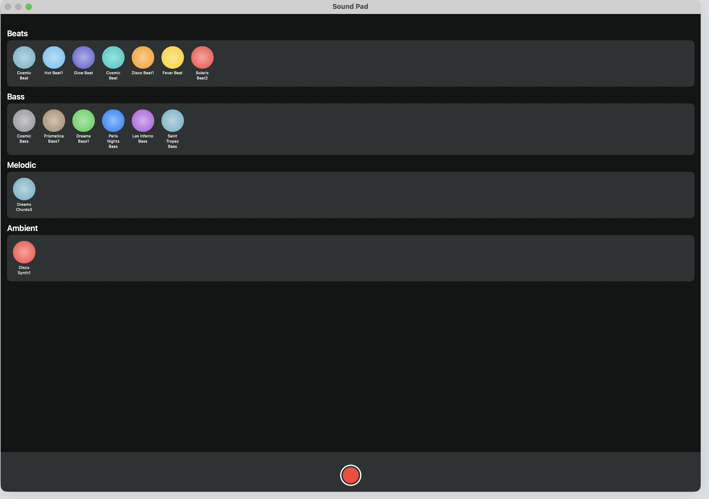

# 🎵 SoundPadView

A fun and interactive SwiftUI interface that lets you tap to trigger loops and beats. Perfect for experimenting with sound and building a custom mix!

## 🚀 Features

- 🎧 Tap-to-play sound loops
- 🎨 Color-coded buttons for intuitive layout
- 🔁 Categorized into Beats, Bass, Melody, and Ambient sections
- 🧱 Easy to expand by adding new `LoopButton`s

---

## 🖼️ App Preview

> Insert a screenshot or GIF of the full app UI here

**Example Layout:**



---

## 🧩 Code Overview

The `SoundPadView` uses custom `LoopButton` components grouped inside:

- `Beats { ... }`
- `Bass { ... }`
- `Melodic { ... }`
- `Ambient { ... }`

Each button is tied to a specific sound and styled with a SwiftUI `Color`.

```swift
LoopButton(beat: .HotBeat1, color: .cyan)
LoopButton(bass: .PrismaticaBass7, color: .brown)
LoopButton(melodic: .DreamsChords3, color: .teal)
LoopButton(ambient: .DiscoSynth1, color: .red)
